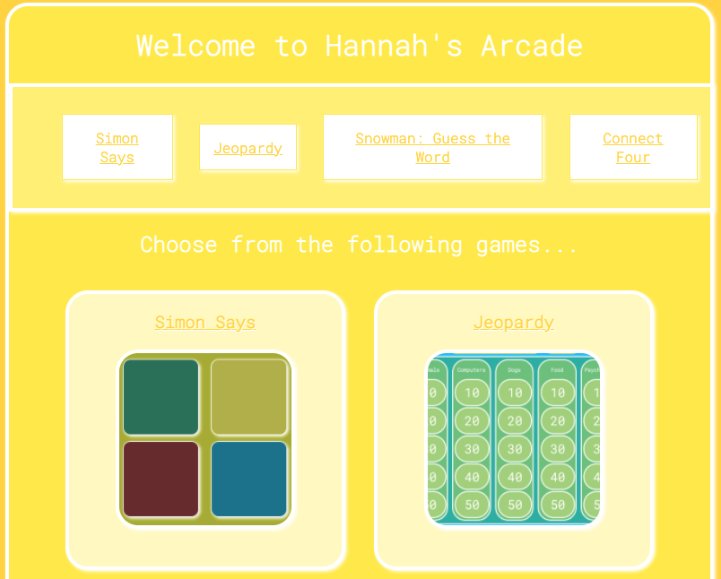
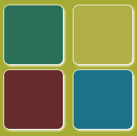
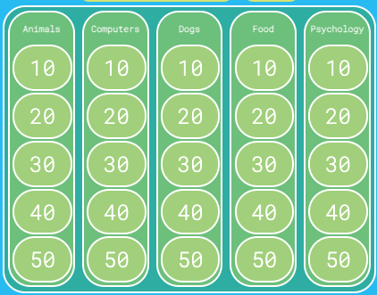
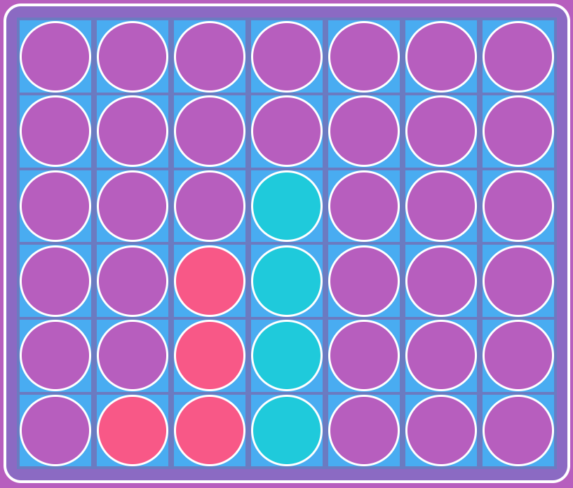

# [Hannah's Arcade](https://hannahgardner96.github.io/)  

## Overview of Project 1  
Project 1 Goal: create a game using JavaScript, TypeScript, CSS, and HTML that integrates DOM maniuplation through JS, responds to event listeners, and allows a user to play at least one round of a game.  
 
I began with a virtual version of Simon Says which required some basic knowledge of asynchronous JavaScript. After finishing this, I created a hiden word guessing game, Connect Four, and Jeopardy. I housed my games on an arcade homepage to enable seamless navigation. Below, I will elaborate on the technologies used, notable challenges, and interesting features.  

***

## [Simon](https://hannahgardner96.github.io/Project1/Simon/)  
Simon begins with a modal that prompts a user to select from three avatar options. Upon selection, the modal disappears and the avatar appears next to their score. In the game instructions, the user is told to press "START". This triggers the background of a simon button to change as if it is lighting up. The user is alerted that it is their turn and they should imitate the sequence of lights that "Simon" demonstrated. Each time a player successfully imitates the sequence of lights, the sequence gets longer by one light. This will continue until the player incorrectly imitates the light sequence at which point an alert will pop up stating their score and that they lost.  
 

### Technologies Used  
This required a review of asynchronous JavaScript. I read the articles linked in [this article](https://developer.mozilla.org/en-US/docs/Learn/JavaScript/Asynchronous). Additionally, I implemented vanilla JavaScript, TypeScript, HTML, and CSS.  I used Sketch to wireframe and Google Fonts for styling.  

### Notable Challenges  
Simon's sequence was determined by pushing random indices from one array into another. The new array was itterated over by a for of loop that triggered the display change of each button. Without asynchronous JS, all of the displays changed synchronously instead of sequentially. The challenge here came from understanding the syntax of a promise as well as how async and await impacted the queue of functions. By strategically awaiting certain functions, I was able to sequentially change the display of buttons as well as time alerts to occur after display changes are completed.  

### Interesting Features  
#### timeout(f, milliseconds)  
I consulted someone with experience for support adjusting the timing of display changes and alerts. These changes were so abrupt that the user experience was a bit jarring. With his help, I structured a promise that implemented setTimout() to create distinct delays between the execution of functions.  

***

## [Snowman: Guess the Hidden Word](https://hannahgardner96.github.io/Project1/Snowman/)  
When the player presses start, Snowman begins! A secret word is randomly selected from an array. It is appended to a header element on the page with the display set to none. Using this word, I created an array of individual letters that could be compared to the buttons pressed by the player. If the player presses the button for a letter contained in the array, the display of the LI containing that letter is changed to inline. If the letter is not contained in the array, incorrect guesses increases by one. If incorrect guesses reaches six, the player loses. If the played changes the display of every LI to inline, they win. 
 

### Technologies Used  
I implemented vanilla JavaScript, TypeScript, HTML, and CSS.  I used Sketch to wireframe and Google Fonts for styling. 

### Notable Challenges  
In order to limit the continued populatin of the UL with hidden words, I had to dynamically remove and add event listeners. Inititally, this seemed unfeasible. However, after some research, I found it was easiest to remove event listeners in the form of ".addEventListener("click")" that called a sinle function. Originally, my event listeners were in the ".onclick" format and called multiple functions. By creating a single event listener function to call and adjusting the format, I could easily add and remove the listeners. 

### Interesting Features  
In order to determine if all the LI displays had been changed to "inline" I needed an array of styles. Using the "document.getElement(s)ById/Class/Etc.().style.display gave me an error message. After consulting someone with experience, I used "window.getComputedStyle().display, a tool new to me. I found this tool helpful in subsequent games throughout the project. 

***

## [Jeopardy](https://hannahgardner96.github.io/Project1/Jeopardy/)  

 
 

### Technologies Used  
I used asynchronous JS for the timing of revealin the final jeopardy question. Otherwise, I implemented vanilla JavaScript, TypeScript, HTML, and CSS.  I used Google Fonts for styling.

### Notable Challenges  
### Interesting Features  

***

## [Connect Four](https://hannahgardner96.github.io/Project1/ConnectFour/)  

 
 

### Technologies Used  
I implemented vanilla JavaScript, TypeScript, HTML, and CSS.  I used Google Fonts for styling.

### Notable Challenges  
### Interesting Features  

***