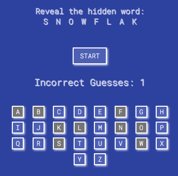

# [Hannah's Arcade](https://hannahgardner96.github.io/)  

## Overview of Project 1  
Project 1 Goal: create a game using JavaScript, TypeScript, CSS, and HTML that integrates DOM maniuplation through JS, responds to event listeners, and allows a user to play at least one round of a game.  
 
I began with a virtual version of Simon Says which required some basic knowledge of asynchronous JavaScript. After finishing this, I created a hiden word guessing game, Connect Four, and Jeopardy. I housed my games on an arcade homepage to enable seamless navigation. Below, I will elaborate on the technologies used, notable challenges, and interesting features.  

***

## [Simon](https://hannahgardner96.github.io/Project1/Simon/)  
Simon begins with a modal that prompts a user to select from three avatar options. Upon selection, the modal disappears and the avatar appears next to their score. In the game instructions, the user is told to press "START". This triggers the background of a simon button to change as if it is lighting up. The user is alerted that it is their turn and they should imitate the sequence of lights that "Simon" demonstrated. Each time a player successfully imitates the sequence of lights, the sequence gets longer by one light. This will continue until the player incorrectly imitates the light sequence at which point an alert will pop up stating their score and that they lost.  
 

### Technologies Used  
This required a review of asynchronous JavaScript. I read the articles linked in [this article](https://developer.mozilla.org/en-US/docs/Learn/JavaScript/Asynchronous). Additionally, I implemented vanilla JavaScript, TypeScript, HTML, and CSS.  I used Sketch to wireframe and Google Fonts for styling.  

### Notable Challenges  
Simon's sequence was determined by pushing random indices from one array into another. The new array was itterated over by a for of loop that triggered the display change of each button. Without asynchronous JS, all of the displays changed synchronously instead of sequentially. The challenge here came from understanding the syntax of a promise as well as how async and await impacted the queue of functions. By strategically awaiting certain functions, I was able to sequentially change the display of buttons as well as time alerts to occur after display changes are completed.  

### Interesting Features  
#### timeout(f, milliseconds)  
I consulted someone with experience for support adjusting the timing of display changes and alerts. These changes were so abrupt that the user experience was a bit jarring. With his help, I structured a promise that implemented setTimout() to create distinct delays between the execution of functions.  

***

## [Snowman: Guess the Hidden Word](https://hannahgardner96.github.io/Project1/Snowman/)  
When the player presses start, Snowman begins! A secret word is randomly selected from an array. It is appended to a header element on the page with the display set to none. Using this word, I created an array of individual letters that could be compared to the buttons pressed by the player. If the player presses the button for a letter contained in the array, the display of the LI containing that letter is changed to inline. If the letter is not contained in the array, the value of incorrect guesses increases by one. If incorrect guesses reaches six, the player loses. If the player changes the display of every LI element to inline, they win. 
 

### Technologies Used  
I implemented vanilla JavaScript, TypeScript, HTML, and CSS.  I used Sketch to wireframe and Google Fonts for styling. 

### Notable Challenges  
In order to limit the continued population of the UL with hidden words, I had to dynamically remove and add event listeners. Inititally, this seemed unfeasible. However, after some research, I found it was easiest to remove event listeners in the form of ".addEventListener("click")" that called a single function. Originally, my event listeners were in the ".onclick" format and called multiple functions. By creating a single event listener function to call and adjusting the format, I could easily add and remove the listeners. 

### Interesting Features  
In order to determine if all the LI displays had been changed to "inline" I needed an array of styles. Using "document.getElement(s)ById/Class/Etc.().style.display" produced an error message. After consulting someone with experience, I used "window.getComputedStyle().display", a tool new to me. I found this tool helpful in subsequent games throughout the project. 

***

## [Jeopardy](https://hannahgardner96.github.io/Project1/Jeopardy/)  
The player decides when and how to start this simplified approach to Jeopardy. With the option to select from five categories at five difficulties, the player can begin with a challenge or just dip their toes in the water. By clicking on a tile, the player flips it over to reveal a question. The "focus" immediately shifts to the input bar, visually prompting the player to type an answer. Upon submit, their response is converted to lowercase letters for easy comparison to the correct answer which is stored in a separate div. Each tile is composed of a "card front", "card back", "answer", and "completed" div. When every "completed" div's style is set to "inline-block", the player is prompted to answer the final question. After answering, if their score is above zero, they win. If their score is below zero, they lose.  
 

### Technologies Used  
I used asynchronous JS for the timing of revealing the final jeopardy question. Otherwise, I implemented vanilla JavaScript, TypeScript, HTML, and CSS.  I used Google Fonts for styling.

### Notable Challenges  
When adding the event listener to the final question, it alerted the player to their score and whether they won prior to actually running the runFinalQuestion() function. I was able to utilize the knowledge I gained from Simon Says to integrate asynchronous JS into my code. I consulted someone with experience for support on syntax and turned the clicking of the submit button into a promise to force the remainder of the function to await its completion.

### Interesting Features  
After two games in which the addition and removal of event listeners became necessary, I decided to take a different approach that enabled my storing all event listeners in one section. By creating functions that added and removed event listeners to and from different DOM elements, I could dilineate the listeners I planned to use throughout the program in one place and then call them dynamically. See the final section (beginning on line 129 of my [TS file](https://github.com/hannahgardner96/hannahgardner96.github.io/blob/master/Project1/Jeopardy/jeopardy.ts)) to review event listener functions.

***

## [Connect Four](https://hannahgardner96.github.io/Project1/ConnectFour/)  
The header of the page immediately prompts player 1 to select a column and place a tile. The font is the color of the tile that will be placed. After clicking a column, a tile appears at the bottom. The text at the top of the page immediately changes to declare player 2's turn. Following the same steps, it shifts back to player 1's turn. Once one player has four tiles in a row (vertically, horizontally, or diagonally), an alert pops up to notify the player that they won. 
 

### Technologies Used  
I implemented vanilla JavaScript, TypeScript, HTML, and CSS.  I used Google Fonts for styling.

### Notable Challenges  
When I reached the win condition's planning, I was not sure where to begin. After some deliberation, I wrote a vertical win scenario that checked if spaces existed four spaces below the current space and if they were all the same color. However, a horizontal and diagonal win still eluded me. Upon consultation of someone with experience, I began thinking about how I could structure a grid (an array of arrays) to determine win scenarios. Using a combination of different for loops, I examined the presence or absence of player tiles at different locations on the board, checking if four in a row contained either player 1's tile or player 2's tile.

### Interesting Features  
All colors used in JS are declared in the rgb() format. Using hex codes produced an error message. After further examining why my conditionals were failing, I realized JS was attempting to compare the strings of a hex code and rgb() value for the same color. Changing all my colors to rgb() values immediately solved the problem.
***